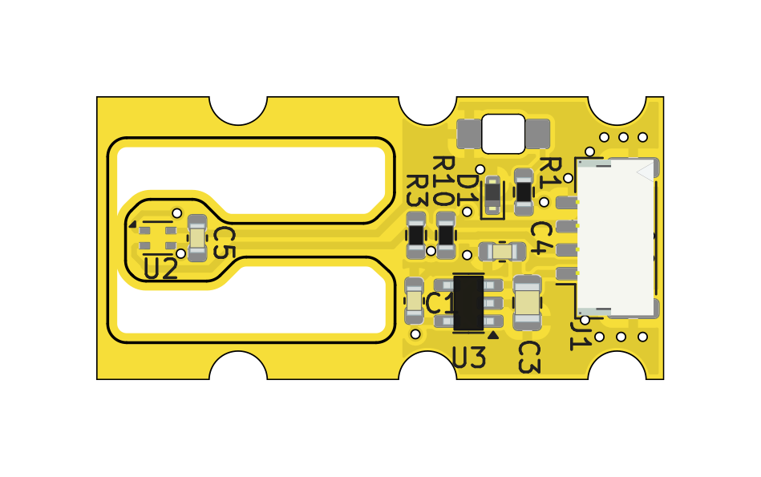

# TFHT02 - Miniature UAV Humidity and Temperature Sensor

[](https://github.com/ThunderFly-aerospace/TFHT02/actions/workflows/kicad_outputs.yml)

The TFHT02 hygrometer sensor offers flexible integration options. It can be directly connected to a Pixhawk autopilot with PX4 firmware, or it can be used as a sensor for the [TF-ATMON monitoring system](https://www.thunderfly.cz/tf-atmon.html). The TFHT02 is optimized for fast response and reduced sensitivity to solar radiation, making it suitable for meteorological measurements of atmospheric profiles, where rapid environmental changes require fast response to maintain high measurement accuracy.

### Atmospheric sounding

The TFHT02 sensor is designed for [direct atmospheric sounding](https://en.wikipedia.org/wiki/Atmospheric_sounding). Here is an example of measured data taken by [TF-G2 autogyro](https://www.thunderfly.cz/tf-g2.html).


## Where to get it?

The TFHT02 is commercially available from [ThunderFly s.r.o.](https://www.thunderfly.cz/). For a commercial quotation or support, contact us by email at sale@thunderfly.cz or shop at [Tindie store](https://www.tindie.com/products/thunderfly/tfht01-aerial-hygrometer-and-thermometer/).


## Parameters

| Parameter | Value | Description |
|-----------|-------|-------------|
| Sensing element | [SHT45](https://sensirion.com/media/documents/33FD6951/662A593A/HT_DS_Datasheet_SHT4x.pdf) | Other possible sensors are SHT40 or SHT41 |
| Typical accuracy | 1 %RH and 0.1 °C | |
| Repeatability | 0.15 %RH , 0.08 °C | The stated repeatability is 3 times the standard deviation (3σ) of multiple consecutive measurements at constant ambient conditions. |
| Operating temperature range| 0 °C - +65 °C | Sensor physically measures in range -40°C to +120°C with reduced accuracy |
| Operating humidity range| 0-100 % | At humidity above 80% the performance of the sensor could be degraded in case of prolonged periods |
| I2C connector | 4-pin JST-GH | The second connector could be installed on the opposite side |
| I2C address | 0x44 | |
| Storage temperature range| -20 °C - +40 °C |  |
| Operational input voltage | 3.6 - 5.4V | Overvoltage is internally protected by zener diode |
| Mass | 2 g | PCB without cabling |
| Dimensions | 30 x 15 x 6.5 mm |  PCB |
| Weather resistance | IP40 | External connectors fully occupied. |

## Sensor Design

The TFHT02 sensor is designed with an emphasis on fast response time and minimal sensitivity to solar radiation. This is achieved by reducing the thermal mass around the sensing element, allowing it to rapidly react to changes in ambient conditions. Additionally, the sensor is positioned in a way that maximizes its contact surface with the surrounding airflow, ensuring efficient heat exchange and accurate real-time measurements, which are critical for meteorological applications, especially for atmospheric profiling.




### Schematics

[](/doc/gen/TFHT02-schematic.pdf)

## Usage in PX4 autopilot firmware

The PX4 autopilot firmware supports the sensor. Multiple sensors can be connected to one autopilot. The measured data could be sent to the ground station and at the same time logged in the onboard ulog file. Sensor support can be enabled by setting the [SENS_EN_SHT4X](http://docs.px4.io/master/en/advanced_config/parameter_reference.html#SENS_EN_SHT3X) parameter to 1.

### Driver Commands Examples

CLI usage example:

    sht4x start -X

Start the sensor driver on the external bus

    sht4x status

Print driver status

    sht4x values

Print the last measured values

    sht4x reset

Reinitialize senzor, reset flags

### PX4 Driver Usage

```
sht4x <command> [arguments...]
 Commands:
   start
     [-I]        Internal I2C bus(es)
     [-X]        External I2C bus(es)
     [-b <val>]  board-specific bus (default=all) (external SPI: n-th bus
                 (default=1))
     [-f <val>]  bus frequency in kHz
     [-q]        quiet startup (no message if no device found)
     [-a <val>]  I2C address
                 default: 68
     [-k]        If initialization (probing) fails, keep retrying periodically

   stop

   status        print status info

   values        Print actual data

   reset         Reinitialize sensor
```

## Usage in Ardupilot firmware

In the Ardupilot firmware, the corresponding sht4x driver for TFHT02 is currently missing. The contributions are welcomed.
